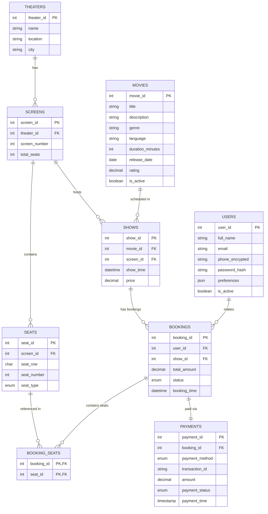

# Entity Relationship Diagram

```mermaid
erDiagram
    USERS ||--o{ BOOKINGS : makes
    MOVIES ||--o{ SHOWS : "scheduled in"
    THEATERS ||--o{ SCREENS : has
    SCREENS ||--o{ SHOWS : hosts
    SCREENS ||--o{ SEATS : contains
    SHOWS ||--o{ BOOKINGS : "has bookings"
    BOOKINGS ||--o{ BOOKING_SEATS : "contains seats"
    SEATS ||--o{ BOOKING_SEATS : "referenced in"
    BOOKINGS ||--|| PAYMENTS : "paid via"

    USERS {
        int user_id PK
        string full_name
        string email
        string phone_encrypted
        string password_hash
        json preferences
        boolean is_active
    }

    MOVIES {
        int movie_id PK
        string title
        string description
        string genre
        string language
        int duration_minutes
        date release_date
        decimal rating
        boolean is_active
    }

    THEATERS {
        int theater_id PK
        string name
        string location
        string city
    }

    SCREENS {
        int screen_id PK
        int theater_id FK
        int screen_number
        int total_seats
    }

    SHOWS {
        int show_id PK
        int movie_id FK
        int screen_id FK
        datetime show_time
        decimal price
    }

    SEATS {
        int seat_id PK
        int screen_id FK
        char seat_row
        int seat_number
        enum seat_type
    }

    BOOKINGS {
        int booking_id PK
        int user_id FK
        int show_id FK
        decimal total_amount
        enum status
        datetime booking_time
    }

    BOOKING_SEATS {
        int booking_id PK, FK
        int seat_id PK, FK
    }

    PAYMENTS {
        int payment_id PK
        int booking_id FK
        enum payment_method
        string transaction_id
        decimal amount
        enum payment_status
        timestamp payment_time
    }
```
